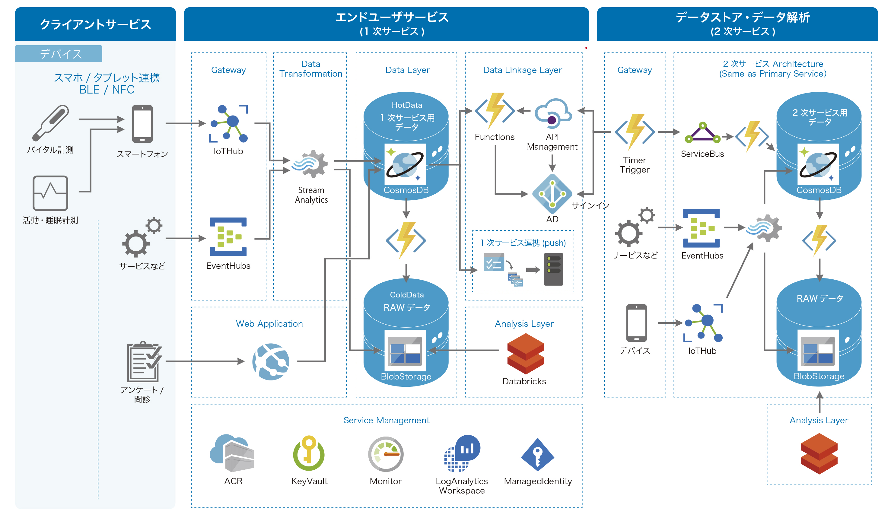

# PHR PoC Template

このリポジトリは、[PHR リファレンスアーキテクチャ](https://aka.ms/PHR_RA)に基づくサンプル実装です。

:warning: _This document supports in Japanese only for now, sorry._

# Getting Started

リソースはAzure Resource Manager Templateを使ってデプロイできます。手順について詳しくは[デプロイ方法](docs/ja/DeployResources.md)を確認してください。

- デプロイされるAzureリソースついては、[こちらの命名規則](docs/ja/AzureNamingConvention.md)に記載されています。

デプロイができたらサンプルアプリケーションを動かしてみましょう。
EventHubs経由でメトリクスを送信し画面でグラフを表示することができます。詳しい手順は、[サンプルアプリケーションを使った動作確認](docs/ja/Demo.md)を確認してください。

# Simulator

体温, 血圧(拡張期血圧, 収縮期血圧), 脈拍, SpO2などのデータを体温計, 血圧計, 血糖値計, パルスオキシメータやボイスアシスタントを使ってEventHubsやIoTHubsにデータを送信するシミュレータを用意しています。

- [EventHubsへのデータ送信手順](docs/ja/SendToEventHubs.md)
- [IoTHubへのデータ送信手順](docs/ja/SendToIoTHub.md)

# Definition

## 基盤へのデータ送信仕様

- [IoTGatewayインタフェース仕様](docs/ja/IoTGatewayInterface.md)

## 健康情報データ

[日本医療情報学会：生活習慣病コア項目セット集（第2版）および生活習慣病自己管理項目セット集（第2版）](http://jami.jp/medicalFields/2018Oct23_02.pdf)を参考に項目を定義しCosmosDBに格納しています。詳しくは以下を確認してください。

- [データベース定義](docs/ja/DatabaseDefinition.md)

## サービス連携

2次サービスへのデータ連携の方式, 及びインタフェース項目については[経済産業省：健康情報等交換規約定義書](https://www.meti.go.jp/committee/kenkyukai/shoujo/jisedai_healthcare/kenkou_toushi_wg/kenkou_iryou_joho/pdf/h28_s02_00_01.pdf)に記載されている「別紙1健康情報等交換規約データ項目定義一覧 (1) 計測データ項目定義」を参考に実装されています。詳しくは以下を確認してください。

- [1次サービス連携インタフェース仕様](docs/ja/PrimaryServiceInterface.md)

# License

本ソフトウェアの著作権は[TIS株式会社](https://www.tis.co.jp/)が保持しており、MITライセンスで配布されています。ライセンスに従い、自由にご利用ください。

Copyright (c) 2020 TIS Inc.

以下に定める条件に従い、本ソフトウェアおよび関連文書のファイル（以下「ソフトウェア」）の複製を取得するすべての人に対し、ソフトウェアを無制限に扱うことを無償で許可します。これには、ソフトウェアの複製を使用、複写、変更、結合、掲載、頒布、サブライセンス、および/または販売する権利、およびソフトウェアを提供する相手に同じことを許可する権利も無制限に含まれます。

上記の著作権表示および本許諾表示を、ソフトウェアのすべての複製または重要な部分に記載するものとします。

ソフトウェアは「現状のまま」で、明示であるか暗黙であるかを問わず、何らの保証もなく提供されます。ここでいう保証とは、商品性、特定の目的への適合性、および権利非侵害についての保証も含みますが、それに限定されるものではありません。 作者または著作権者は、契約行為、不法行為、またはそれ以外であろうと、ソフトウェアに起因または関連し、あるいはソフトウェアの使用またはその他の扱いによって生じる一切の請求、損害、その他の義務について何らの責任も負わないものとします。

